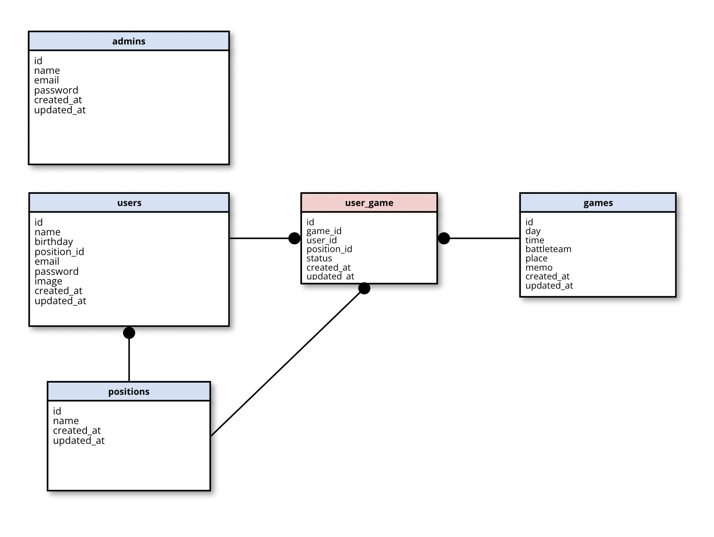

# League-Management
サッカーのリーグ戦管理ツールです。プログラミングスクール受講後、初めてのオリジナルの制作物になります。

自分が社会人のサッカーチームに所属しており、管理できるツールがあればと思い、作成しました。

PHPフレームワークLaravelを使っています。

レイアウトは、TailwindとdaisyUIを利用しています。

とりあえず一つのチームを管理できるような仕様まで実装しました。

管理者となる監督の作成は実装しておらず、DBで直接作成しています。今後改善予定です。

ユーザーは監督と選手に分かれており、監督が選手を作成し、IDとパスワードが付与されることにより

選手がログインできるようになります。

監督が試合日程を作成し、選手がそれに出欠を回答します。その後監督は回答した選手に対して

ポジションを割り振り、選手の参加を確定させます。

## 機能一覧

- 監督側で所定の情報でログイン、ログアウト
- 監督側で新規試合、選手の登録。および、削除、試合の編集。
- 監督側で試合のスタメンを決定、及びスタメンを変更。
- 選手側でログイン、ログアウト。
- 選手側でプロフィール登録。
- 選手側で、試合の参加表明他、及び、回答の取り消し

## 技術要素

- 開発環境 AWS Cloud9
- HTML5/CSS3
- Tailwind CSS 3.1.0
- daisyUI 3.0.3
- PHP 8.1.17
- mysql Ver 5.7.42-0ubuntu0.18.04.1
- バージョン管理 Git/Github
- デプロイ Supabase/Fly.io

## トップ画面

## データベース図

## サイトマップ

## 今後追加したい機能

上述の通り、まずは自分のチームが使えるようにと思っていたので、チーム単位での管理がなく、複数のチームが使用

できるようになっていません。また、監督も現時点では、DBに直接作成しています。

監督のユーザー登録を実装、チームテーブルを作成して、チーム単位での仕様ができるようにしたいと考えています。
